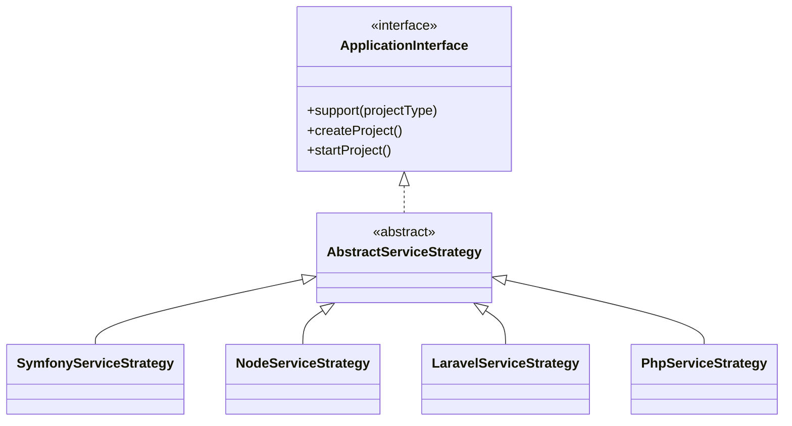
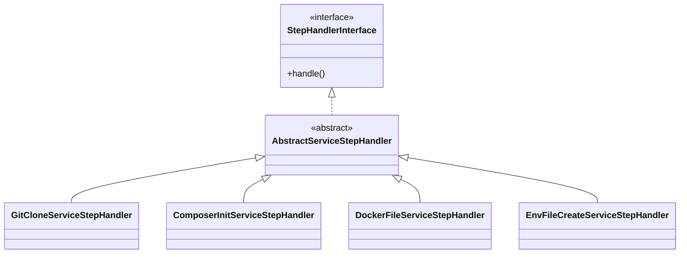
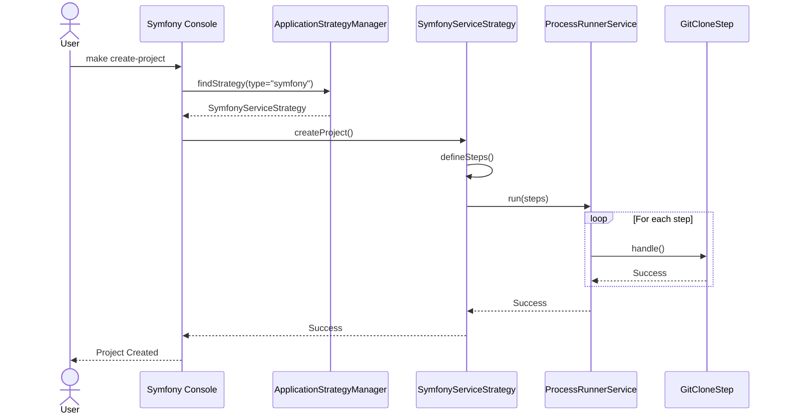

# Architecture Technique

Ce document décrit l'architecture technique du projet **Stack Builder**. Ce projet est conçu pour automatiser la création et la gestion d'environnements de développement Dockerisés pour différentes technologies (PHP, Node.js, etc.).

## Vue d'ensemble

Le projet est une application **Symfony** (CLI et Web) qui agit comme un orchestrateur. Il génère des configurations Docker (docker-compose, Dockerfiles), gère les fichiers d'environnement (.env), et pilote des commandes système (via Makefiles et scripts shell).

### Composants Principaux

1.  **Application Symfony** : Le cœur logique. Elle contient toute la logique métier pour définir comment un projet doit être structuré.
2.  **Docker & Traefik** : L'infrastructure d'exécution. Traefik est utilisé comme reverse-proxy global pour router les requêtes vers les différents projets générés.
3.  **Taskfiles** : L'interface utilisateur principale en ligne de commande.

## Patterns de Conception

L'architecture repose massivement sur le **Pattern Strategy** pour assurer l'extensibilité et la modularité.

### Le Pattern Strategy

Le cœur du système se trouve dans `src/Strategy`. Ce pattern permet de définir des comportements spécifiques pour chaque type d'application (PHP, Symfony, Node.js) ou chaque étape de déploiement, sans coupler le code d'orchestration à des implémentations concrètes.

#### 1. Application Strategy (`src/Strategy/Application`)
Définit comment gérer un type d'application complet.
-   **Interface** : `ApplicationInterface` (ou classe abstraite parente).
-   **Rôle** : Détermine si une stratégie s'applique au projet courant (ex: est-ce un projet Symfony ?) et fournit les services associés (création, démarrage, arrêt).
-   **Exemples** :
    -   `SymfonyApplicationStrategy` : Pour les projets Symfony.
    -   `NodeApplicationStrategy` : Pour les projets Node.js.

#### 2. Step Strategy (`src/Strategy/Step`)
Décompose le processus de déploiement/création en étapes granulaires.
-   **Rôle** : Exécuter une action précise (ex: `GitCloneStep`, `ComposerInstallStep`, `DockerComposeUpStep`).
-   **Utilisation** : Les stratégies d'application assemblent une liste d'étapes à exécuter.

#### 3. Service Strategy (`src/Strategy/Application/Service`)
Gère les actions spécifiques (Create, Start, Stop) pour chaque type d'application.

### Diagrammes de Classes

#### Hiérarchie Application Strategy



#### Hiérarchie Step Strategy



### Le Strategy Manager

Les services situés dans `src/Services/StrategyManager` (ex: `StepServiceManagerService`) sont responsables de :
1.  Découvrir toutes les stratégies disponibles (via l'injection de dépendance et les tags de service Symfony).
2.  Sélectionner la stratégie appropriée pour le contexte actuel.
3.  Exécuter la stratégie.

## Flux d'Exécution

## Générateurs (`src/Generator`)

Ce module contient la logique pour créer physiquement les fichiers de configuration.
-   **EnvFileGenerator** : Crée les fichiers `.env` basés sur des templates et des variables dynamiques.
-   **DockerComposeGenerator** : Génère les configurations Docker adaptées aux services requis (MySQL, Redis, etc.).

## Extensibilité

Pour ajouter le support d'une nouvelle technologie (ex: Python/Django) :

1.  Créer une nouvelle classe dans `src/Strategy/Application/Create` implémentant la logique de création.
2.  Créer une classe dans `src/Strategy/Application/Start` pour la logique de démarrage.
3.  Définir les `Steps` nécessaires (ex: `PipInstallStep`).
4.  Déclarer ces services (généralement automatique avec l'autowiring Symfony).

## Arborescence Clé

```
src/
# Architecture Technique

Ce document décrit l'architecture technique du projet **Stack Builder**. Ce projet est conçu pour automatiser la création et la gestion d'environnements de développement Dockerisés pour différentes technologies (PHP, Node.js, etc.).

## Vue d'ensemble

Le projet est une application **Symfony** (CLI et Web) qui agit comme un orchestrateur. Il génère des configurations Docker (docker-compose, Dockerfiles), gère les fichiers d'environnement (.env), et pilote des commandes système (via Makefiles et scripts shell).

### Composants Principaux

1.  **Application Symfony** : Le cœur logique. Elle contient toute la logique métier pour définir comment un projet doit être structuré.
2.  **Docker & Traefik** : L'infrastructure d'exécution. Traefik est utilisé comme reverse-proxy global pour router les requêtes vers les différents projets générés.
3.  **Taskfiles** : L'interface utilisateur principale en ligne de commande.

## Patterns de Conception

L'architecture repose massivement sur le **Pattern Strategy** pour assurer l'extensibilité et la modularité.

### Le Pattern Strategy

Le cœur du système se trouve dans `src/Strategy`. Ce pattern permet de définir des comportements spécifiques pour chaque type d'application (PHP, Symfony, Node.js) ou chaque étape de déploiement, sans coupler le code d'orchestration à des implémentations concrètes.

#### 1. Application Strategy (`src/Strategy/Application`)
Définit how to manage a complete application type.
-   **Interface** : `ApplicationInterface` (ou classe abstraite parente).
-   **Rôle** : Détermine si une stratégie s'applique au projet courant (ex: est-ce un projet Symfony ?) et fournit les services associés (création, démarrage, arrêt).
-   **Exemples** :
    -   `SymfonyApplicationStrategy` : Pour les projets Symfony.
    -   `NodeApplicationStrategy` : Pour les projets Node.js.

#### 2. Step Strategy (`src/Strategy/Step`)
Décompose le processus de déploiement/création en étapes granulaires.
-   **Rôle** : Exécuter une action précise (ex: `GitCloneStep`, `ComposerInstallStep`, `DockerComposeUpStep`).
-   **Utilisation** : Les stratégies d'application assemblent une liste d'étapes à exécuter.

#### 3. Service Strategy (`src/Strategy/Application/Service`)
Gère les actions spécifiques (Create, Start, Stop) pour chaque type d'application.

### Diagrammes de Classes

#### Hiérarchie Application Strategy


#### Hiérarchie Step Strategy


### Le Strategy Manager

Les services situés dans `src/Services/StrategyManager` (ex: `StepServiceManagerService`) sont responsables de :
1.  Découvrir toutes les stratégies disponibles (via l'injection de dépendance et les tags de service Symfony).
2.  Sélectionner la stratégie appropriée pour le contexte actuel.
3.  Exécuter la stratégie.

## Flux d'Exécution

### Création d'un Projet (`make create-project`)

1.  **Entrée** : L'utilisateur lance la commande.
2.  **Saisie** : L'application demande le type de projet (PHP, Node, etc.) et le nom.
3.  **Sélection** : Le `ApplicationStrategyManager` trouve la stratégie correspondant au type choisi.
4.  **Exécution** :
    -   La stratégie définit une liste d'étapes (`Steps`).
    -   Le `ProcessRunnerService` exécute chaque étape séquentiellement (génération de fichiers, commandes shell, etc.).

#### Diagramme de Séquence : Création



### Démarrage d'un Projet (`make start`)

1.  **Détection** : L'application analyse le dossier du projet pour identifier son type (présence de `composer.json`, `package.json`, etc.).
2.  **Stratégie** : La stratégie correspondante est chargée.
3.  **Orchestration** :
    -   Génération/Mise à jour des fichiers `.env` et `docker-compose.override.yml` si nécessaire.
    -   Lancement des conteneurs via `docker compose up`.
    -   Enregistrement auprès de Traefik.

## Générateurs (`src/Generator`)

Ce module contient la logique pour créer physiquement les fichiers de configuration.
-   **EnvFileGenerator** : Crée les fichiers `.env` basés sur des templates et des variables dynamiques.
-   **DockerComposeGenerator** : Génère les configurations Docker adaptées aux services requis (MySQL, Redis, etc.).

## Extensibilité

Pour ajouter le support d'une nouvelle technologie (ex: Python/Django) :

1.  Créer une nouvelle classe dans `src/Strategy/Application/Create` implémentant la logique de création.
2.  Créer une classe dans `src/Strategy/Application/Start` pour la logique de démarrage.
3.  Définir les `Steps` nécessaires (ex: `PipInstallStep`).
4.  Déclarer ces services (généralement automatique avec l'autowiring Symfony).

## Arborescence Clé

```
src/
├── Generator/          # Génération de fichiers (Env, Docker)
├── Services/           # Services métiers transverses
│   └── StrategyManager/ # Orchestrateurs de stratégies
├── Strategy/           # Implémentations du pattern Strategy
│   ├── Application/    # Stratégies par type d'app (Create, Start)
│   ├── Step/           # Étapes unitaires (Build, Start)
│   └── DockerService/  # Configuration des services Docker (MySQL, etc.)
└── Model/              # Objets de données (DTOs)
```
